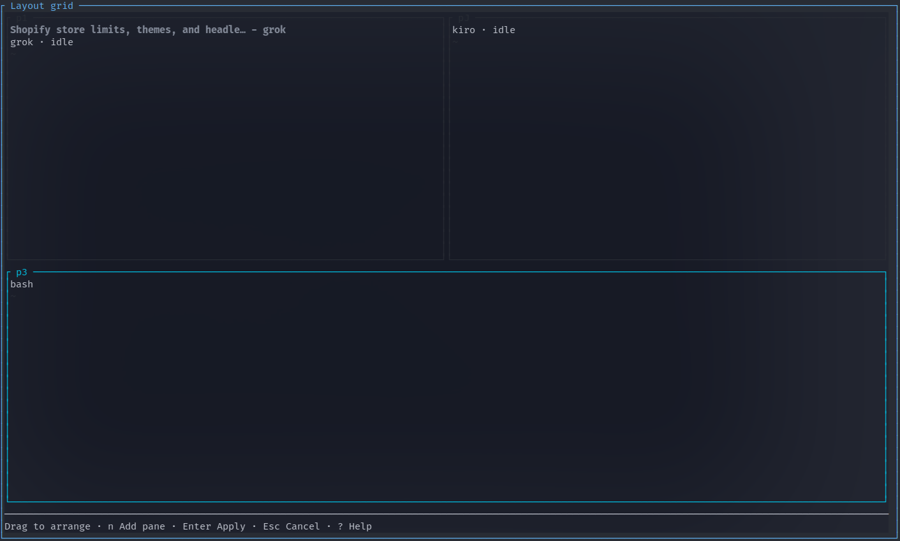
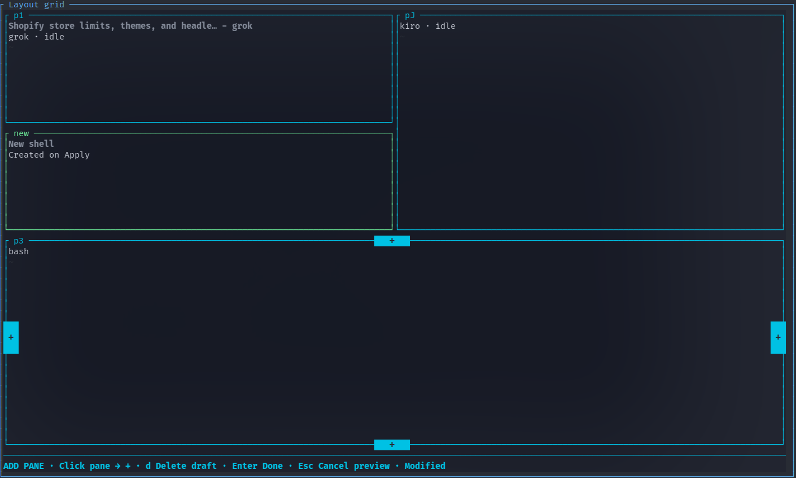
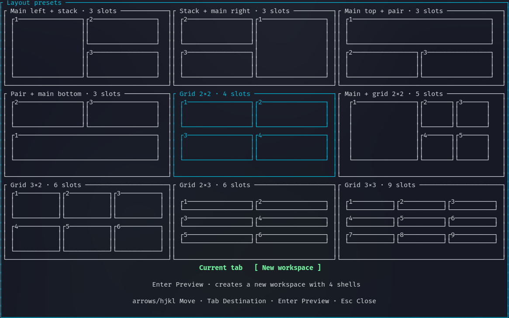

# herdr-grid

[](https://github.com/thuanlm215/herdr-grid/actions/workflows/ci.yml)
[](LICENSE)

A visual drag-and-drop layout editor for live [Herdr](https://herdr.dev/)
panes.

`herdr-grid` opens as a popup for the active tab. Rearrange panes, resize
splits, preview the result, and apply the complete layout without restarting
the processes running inside those panes.

> [!IMPORTANT]
> This project is under active development. Test it with a disposable Herdr
> session before using it with important long-running processes.

## Screenshots

### Arrange and resize panes



### Add shell panes

Draft panes are highlighted in green and are created only when the completed
preview is applied.



### Layout presets

Press `p` to open a visual gallery of fixed layouts, including 2×2 and 3×3
grids and asymmetric main-pane layouts. Apply the preset to the current tab or
use it to create a fresh workspace.



## Features

- Drag a pane onto another pane to swap their positions.
- Drop on an edge to create a new horizontal or vertical relationship.
- Drag split dividers to resize panes.
- Preview one or more new shell panes and create them together on Apply.
- Choose a fixed layout preset; missing slots become new shell panes.
- Build a preset in the current tab or in a newly created workspace.
- Balance every split in the preview to 50/50 with one key.
- Rearrange and resize the layout with keyboard controls.
- Undo or reset changes before they reach Herdr.
- Apply the preview explicitly with `Enter`; cancel safely with `Esc`.
- Preserve live PTYs, pane identities, process state, and scrollback.
- Revalidate the live layout before applying any change.
- Reconcile ambiguous API outcomes and attempt to restore the original layout
  after a partial failure.

## Requirements

- Herdr 0.8.2 or newer
- Linux or macOS
- A terminal with mouse-event support
- Rust stable and Cargo when building from source

Windows is not supported yet. Tagged releases provide prebuilt binaries for
ARM64 and AMD64 macOS, plus statically linked ARM64 and AMD64 Linux.

## Install

Install directly from GitHub with Herdr:

```sh
herdr plugin install thuanlm215/herdr-grid
```

Herdr clones the repository, shows the manifest for review, builds the release
binary, and registers the plugin.

### Local development

From a local checkout, build the release binary and link the plugin:

```sh
git clone https://github.com/thuanlm215/herdr-grid.git
cd herdr-grid
cargo build --release --locked
herdr plugin link . --enabled
```

If the plugin was previously linked in disabled mode, enable it with:

```sh
herdr plugin enable herdr-grid
```

## Usage

Open the editor through its plugin action:

```sh
herdr plugin action invoke open --plugin herdr-grid
```

The editor reads the tab underneath the popup and performs no writes until
you apply the preview.

### Optional shortcut: `prefix + t`

Run the following block to bind `prefix + t` to the layout editor. It appends
the binding without overwriting the rest of your Herdr configuration, avoids
adding it twice, and stops if another command already uses the same key:

```sh
herdr_grid_config="${HERDR_CONFIG_PATH:-${XDG_CONFIG_HOME:-$HOME/.config}/herdr/config.toml}"
mkdir -p "$(dirname "$herdr_grid_config")"
touch "$herdr_grid_config"

if grep -Fq 'command = "herdr-grid.open"' "$herdr_grid_config"; then
  echo "herdr-grid shortcut is already configured"
elif grep -Eq '^[[:space:]]*key[[:space:]]*=[[:space:]]*"prefix\+t"' "$herdr_grid_config"; then
  echo "prefix+t is already assigned; edit $herdr_grid_config manually" >&2
  exit 1
else
  tee -a "$herdr_grid_config" >/dev/null <<'EOF'

[[keys.command]]
key = "prefix+t"
type = "plugin_action"
command = "herdr-grid.open"
EOF
  herdr config check
  herdr server reload-config
fi
```

Herdr's default prefix is `Ctrl+b`, so press `Ctrl+b`, release it, then press
`t`. If you configured a different prefix, use that key followed by `t`.

### Controls

| Input | Action |
| --- | --- |
| Drag pane to center | Swap two panes |
| Drag pane to edge | Re-parent pane at that edge |
| Drag divider | Resize a split |
| Click pane | Select pane |
| `n` | Enter Add pane mode |
| `p` | Open the fixed layout preset gallery |
| Click pane, then edge `+` | Add a draft shell at that edge |
| `d` in Add pane mode | Remove the selected draft pane |
| `Enter` in Add pane mode | Keep drafts in the preview and return to normal mode |
| `Esc` in Add pane mode | Discard the complete preview and return to normal mode |
| Arrow keys or `h/j/k/l` | Move selection |
| `Space` | Pick up or drop selected pane |
| `[` / `]` | Resize selected split |
| `u` | Undo last preview edit |
| `r` | Restore the initial preview |
| `=` in the normal mode | Balance every split in the preview to 50/50 |
| `Enter` | Validate and apply preview |
| `Esc` or `q` in the normal mode | Cancel without applying |
| `?` | Open the complete in-app help |

### Layout presets

The preset gallery contains equal 2×2, 3×2, 2×3, and 3×3 grids plus common
main-pane arrangements: main-left/right/top/bottom with two companion panes,
and a main pane beside a 2×2 grid.

Use arrow keys or `h/j/k/l` to choose a preset, `Tab` to switch between
**Current tab** and **New workspace**, and `Enter` to preview it. The current
tab option keeps all existing panes and creates draft shells for missing
slots; presets with too few slots are disabled. In a main-pane preset, the
currently selected pane becomes the main pane. The new-workspace option
creates every slot as a new shell and leaves the source workspace untouched.

After returning to the normal editor, you can rearrange the preview further.
Press `Enter` to apply/create it, `u` to return from a new-workspace preview,
or `Esc` to cancel without writing.

For a read-only connectivity check from inside a Herdr-managed pane:

```sh
target/release/herdr-grid --inspect
```

## Safety model

`herdr-grid` edits a local layout model while the popup is open. Apply then:

1. Acquires a process-wide apply lock.
2. Verifies the workspace, tab, pane membership, topology, and split ratios
   against the opening snapshot. Pane output and agent-status revisions do not
   invalidate the preview.
3. Creates requested shell panes, then builds the complete operation plan.
4. Checks the authoritative Herdr layout after each operation.
5. Re-discovers pane locations and rebuilds the original layout if an API
   response is lost or an operation fails.

Structural edits temporarily park non-anchor panes in labelled scratch tabs,
then rebuild the requested tree with `pane.move`. Empty scratch tabs are
removed automatically by Herdr.

The plugin never closes a pane that existed when the editor opened. If Apply
fails after creating a requested shell, it may close only that newly created
pane while restoring the original layout. It never calls `layout.apply` or
`tab.close`. See [Architecture](docs/architecture.md) for details and remaining
failure modes.

For a new-workspace preset, Apply creates an isolated workspace first and
constructs its split tree from Herdr's returned pane IDs. If construction or
verification fails, the plugin closes only that newly created workspace. The
source workspace is never rearranged.

## Development

Run the complete local quality gate:

```sh
cargo fmt --all -- --check
cargo clippy --all-targets --all-features -- -D warnings
cargo test
cargo build --release --locked
```

Live mutation tests must use a named disposable Herdr session. Do not run
structural experiments against the default session.

See [CONTRIBUTING.md](CONTRIBUTING.md) before submitting a change.
Notable user-facing changes are recorded in [CHANGELOG.md](CHANGELOG.md).

## License

Licensed under the [MIT License](LICENSE).
